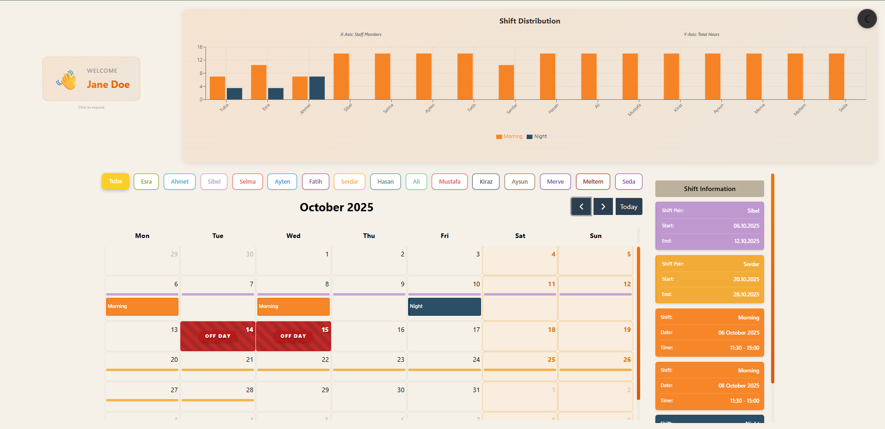
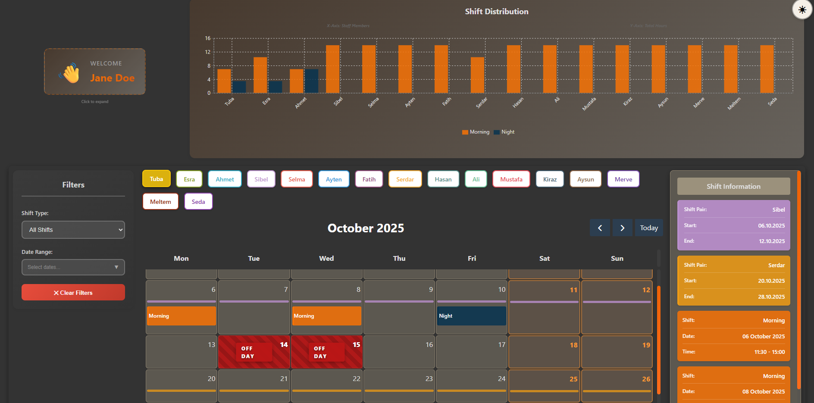

# Staff Scheduling Calendar

A modern React-based staff scheduling application with an interactive calendar, shift management, and data visualization.




## Features

- **Interactive Calendar**: Drag-and-drop shift assignments with FullCalendar integration
- **Advanced Filtering System**: Filter shifts by type and date range with smart staff management
- **Staff Management**: Color-coded staff members with individual schedules
- **Shift Visualization**: Bar charts showing shift distribution and hours per staff
- **Dark Mode**: Toggle between light and dark themes
- **Profile Management**: Expandable profile cards with user information
- **Off-Day Tracking**: Visual indicators for staff off-days in date ranges
- **Pair Shifts**: Support for paired staff assignments with visual highlights

### Installation

1. Clone the repository
```sh
git clone <repository-url>
cd react-project-2025-november
```

2. Install dependencies
```sh
npm install --legacy-peer-deps
```

3. Start the development server
```sh
npm run dev
```

The application will open at `http://localhost:5173`

## Features Overview

### Advanced Filtering System
- **Shift Type Filter**: Filter by All/Morning/Night shifts - staff without selected shift type are automatically disabled
- **Date Range Filter**: Select custom date range with mini calendar picker - only shows shifts within selected period
- **OFF DAY Badges**: Staff with off-days in selected date range display a red "OFF DAY" badge
- **Quick Clear**: Reset all filters with "Clear Filters" button

### Toast Notifications
- **Success Messages**: Green toast notification when changes are saved successfully
- **Error Alerts**: Red toast notification when save operation fails
- **Auto-dismiss**: Notifications automatically disappear after 3 seconds

### Calendar Management
- View and manage staff schedules by month
- Drag-and-drop shifts to different dates
- Click on events to view detailed information
- Color-coded shifts (Morning/Night) and staff members
- Weekend and off-day highlighting

### Data Visualization
- Bar chart showing total shift hours per staff member
- Separate bars for morning and night shifts

### User Interface
- Responsive design with mobile support
- Dark mode toggle with persistent theme
- Custom scrollbar styling
- Smooth animations and transitions

---

